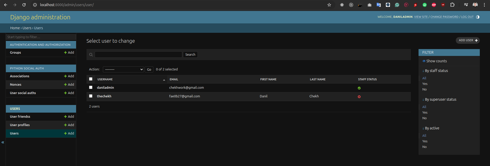
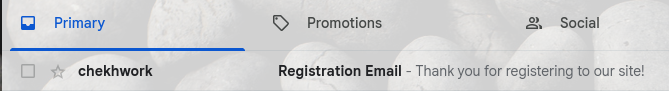
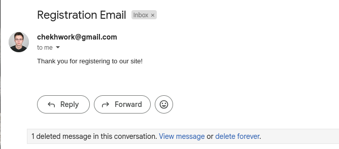
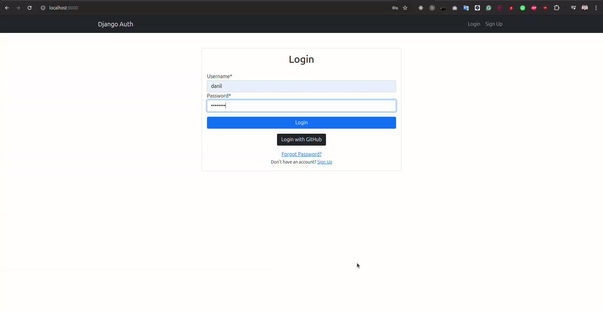
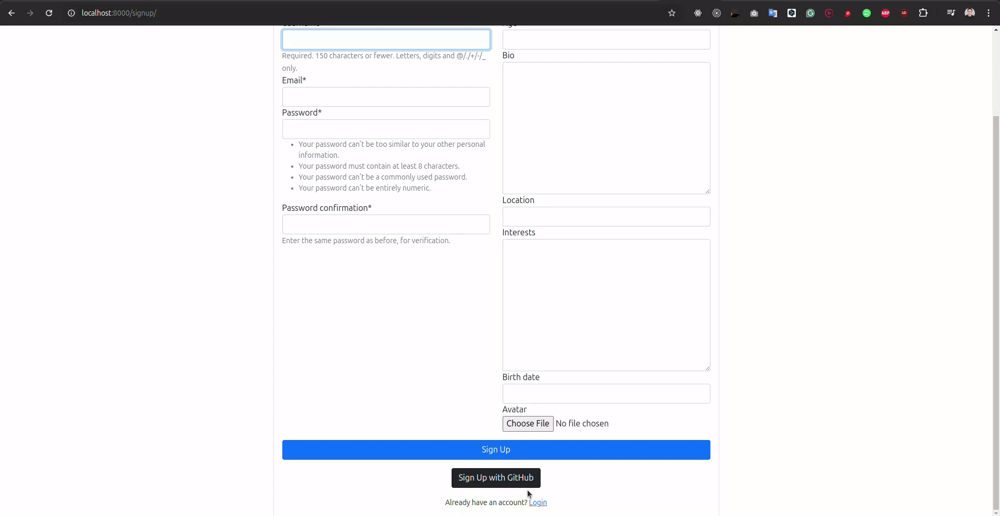
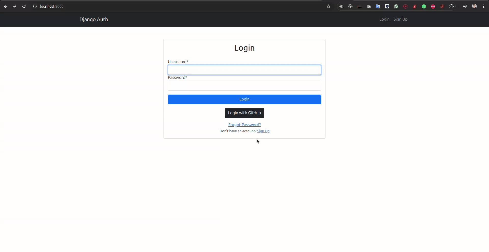
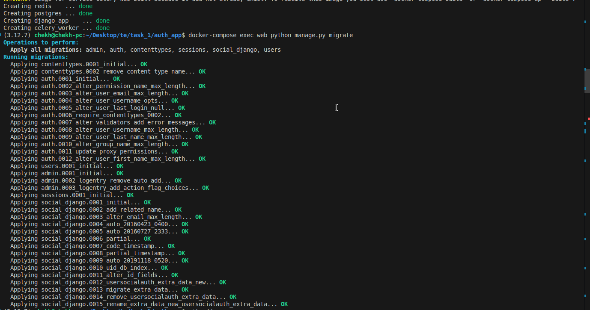
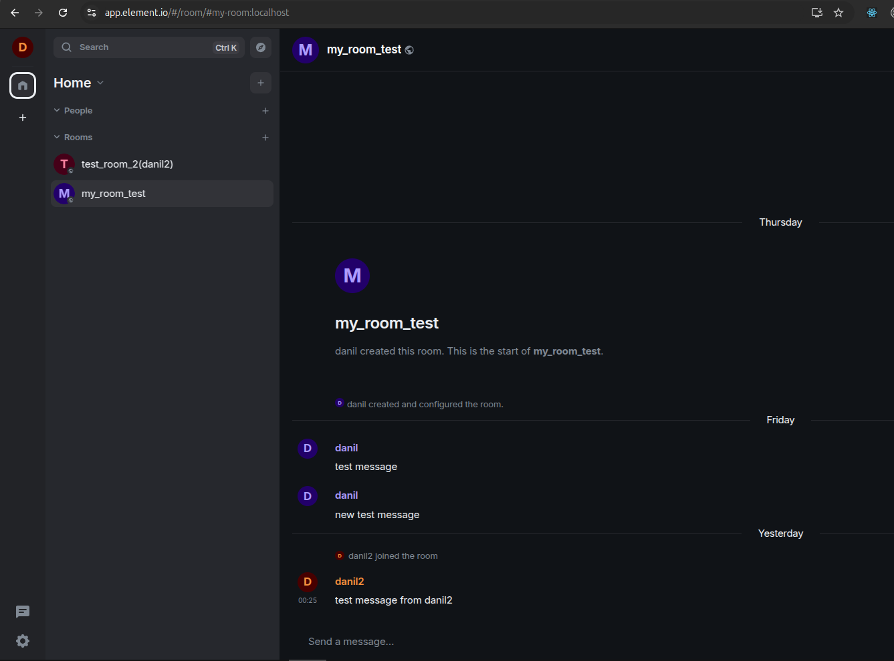
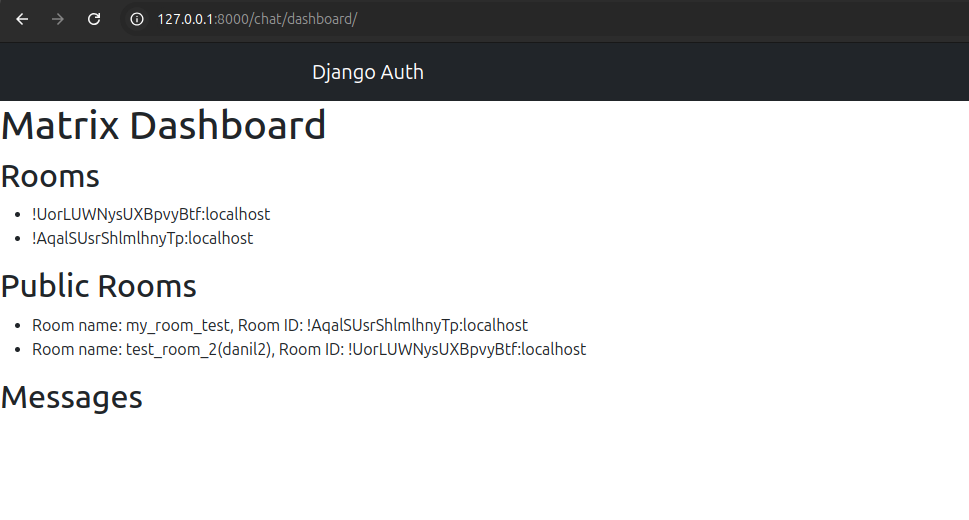

Создать Джанго приложение.
1. Приложение должно содержать как минимум следующие модели: Users,
UserProfile, UserFriends.

All code related to task 2 placed in django app folder users.
```bash
users/models.py
```
1. Проявите воображение во время создания модели пользователей,
например используйте такие поля: возраст, интересы, локация...
2. Все модели должны должны быть зарегистрированы в админ зоне.
```bash
users/admin.py
```

3. Миграции сделаны.
2. Сделать signin/singup пользователей.
1. Через basic auth. C именем пользователя, паролем и почтой, с последующим
заполнение формы для UserProfile. После успешной регистрации пользователь
должен получить имейл и информацией об успешной регистрации. Для
почтового функционала использовать Celery + redis as the broker2. Регистрация через GitHub https://docs.github.com/en/apps/oauth-apps/building-
oauth-apps/differences-between-github-apps-and-oauth-apps

**Signup**:


**Email**:




<br>
<br>
**Login**:


**Github Registration**:


3. Сброс пароля через почту.

**Password reset**:

3. Докерезировать приложение с помощью docker-compose.

Start the containers:
```bash
docker-compose up -d
```
Migrations:
```bash
docker-compose exec web python manage.py migrate
```
Create django admin user:
```bash
docker-compose exec web python manage.py createsuperuser
```

Start working with matrix local server (Not related to task 2):


