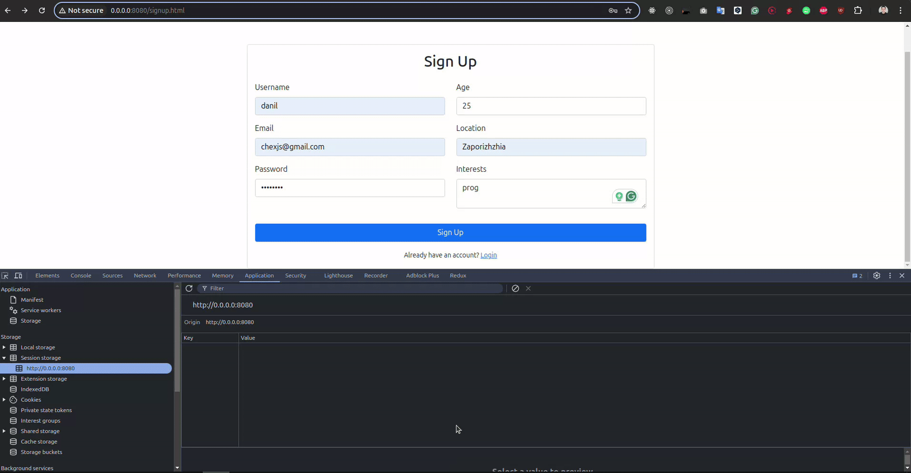
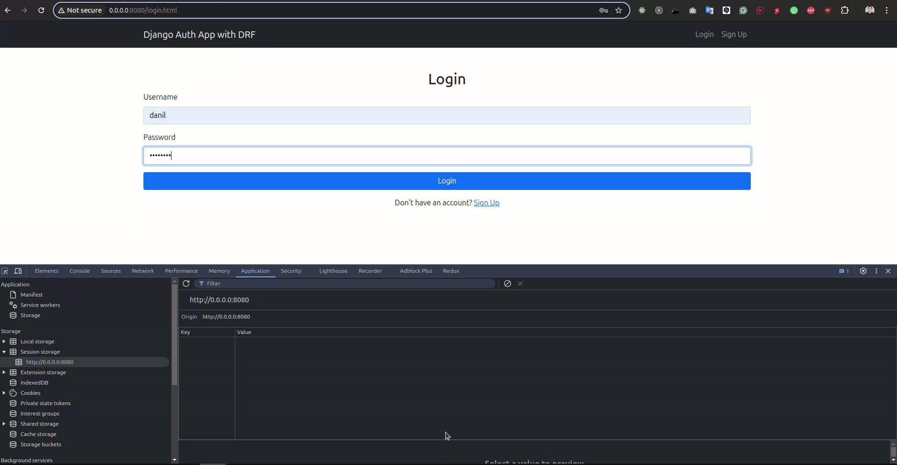
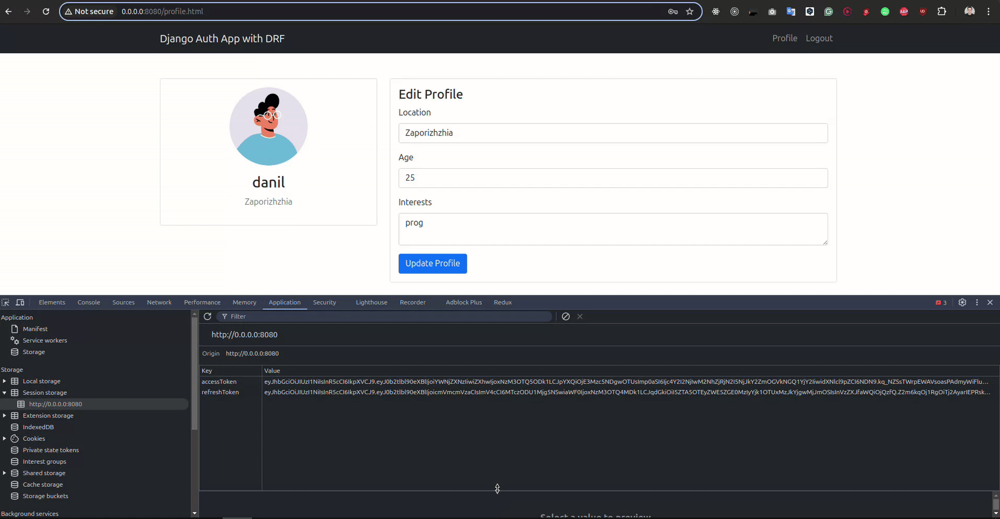
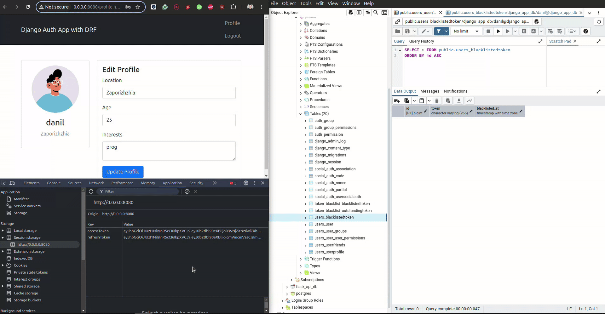
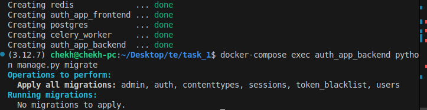

1.  Переписать функциональность управления пользователями на Django Rest Framework (DRF):


```bash
Views path

auth_app/users/views.py

Class views
UserRegistrationView

Functions views
user_profile_view
logout_view
```

Настроить аутентификацию с использованием JWT токенов.

Реализовать всю логику в рамках одного контейнера Docker.

2.  Хранение токенов:
Сохранять AccessToken и RefreshToken в sessionStorage.

Signup



Login



При выполнении действия logout удалять токены из sessionStorage.

Logout



3.  Обработка logout:

Добавлять токен в черный список (реализовать таблицу для хранения заблокированных токенов).



4. Создать frontend интерфейс:

Реализовать две страницы:

Регистрация (Register) — форма для создания нового пользователя.

Авторизация (Login) — форма для входа пользователя.

Выход (Logout) — кнопка для завершения сессии пользователя.

Особенности реализации

Использовать Django Rest Framework для API.

Настроить JWT аутентификацию с помощью библиотеки 
djangorestframework-simplejwt.

Реализовать механизм черного списка для токенов с использованием встроенных возможностей simplejwt.

Frontend разработать с использованием простого JavaScript , подключающегося к DRF API.


Run the app:
```bash
docker-compose up -d

docker-compose exec auth_app_backend python manage.py migrate
```
